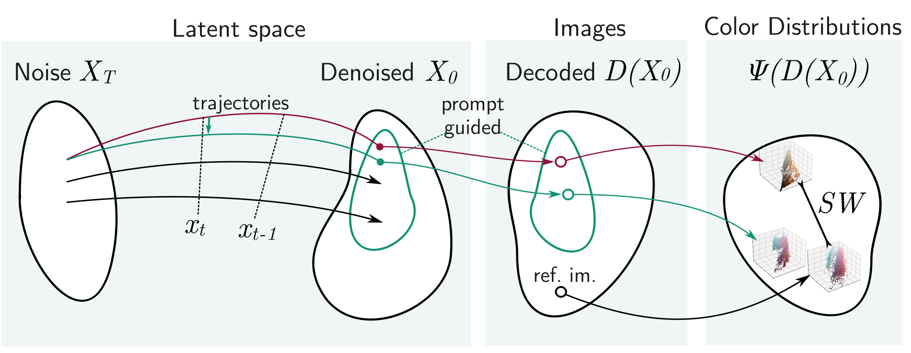
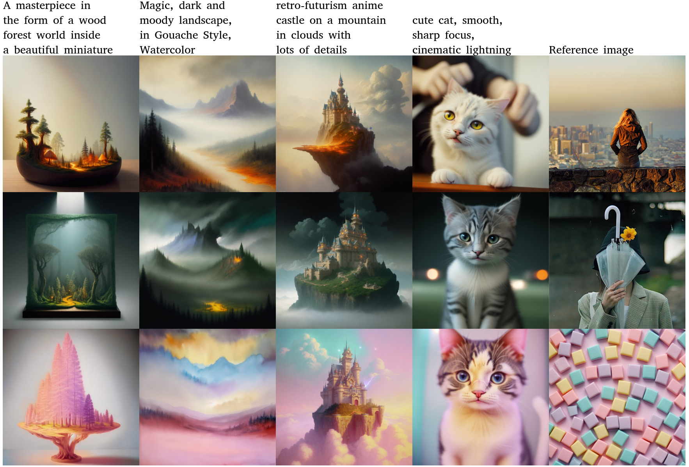
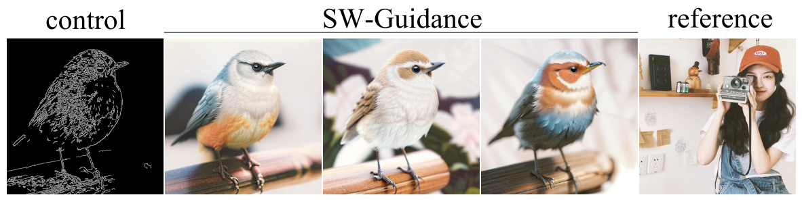
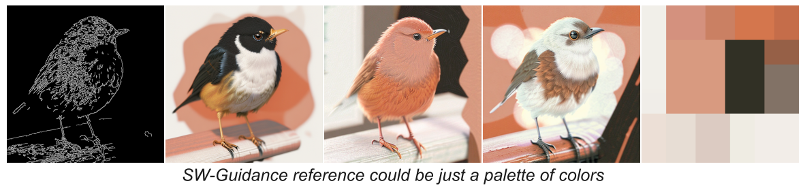
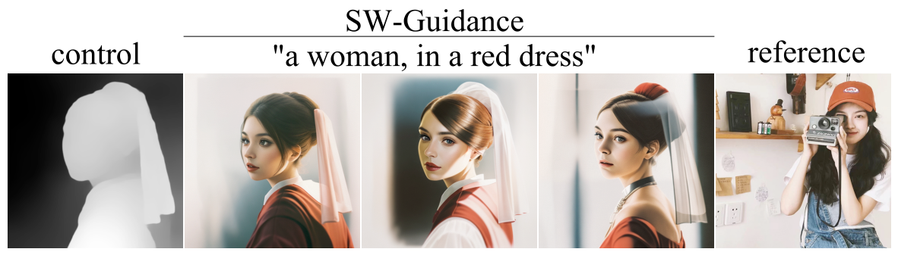

# [NeurIPS 2025, spotlight] Color Conditional Generation with Sliced Wasserstein Guidance

News:

- 22 September 2025: SW-Guidance accepted for spotlight presentation at NeurIPS 2025!

arXiv: https://arxiv.org/abs/2503.19034

This repository contains the source code and instructions for reproducing the results presented in our paper "Color Conditional Generation with Sliced Wasserstein Guidance" by Alexander Lobashev, Maria Larchenko and Dmitry Guskov. SW-Guidance modifies the image generation process of diffusion models by incorporating the color distribution of a reference image directly into the sampling mechanism, thereby overcoming the limitations of sequential text-to-image and style-transfer approaches.

<!--    -->

## Abstract

We propose SW-Guidance, a training-free approach for image generation conditioned on the color distribution of a reference image. While it is possible to generate an image with fixed colors by first creating an image from a text prompt and then applying a color style transfer method, this approach often results in semantically meaningless colors in the generated image. Our method solves this problem by modifying the sampling process of a diffusion model to incorporate the differentiable Sliced 1-Wasserstein distance between the color distribution of the generated image and the reference palette. Our method outperforms state-of-the-art techniques for color-conditional generation in terms of color similarity to the reference, producing images that not only match the reference colors but also maintain semantic coherence with the original text prompt.

## Features

- **Training-Free Approach:** No extra training is required.
- **Color-Conditional Generation:** Directly conditions image generation on a reference color palette.
- **Enhanced Sampling:** Incorporates Sliced 1-Wasserstein distance to align the generated image’s colors with the reference.

  
  

## Compatibility with ControlNets  

Our method is compatible with ControlNets, allowing for even more precise control over image generation while maintaining color consistency.

<p align="center">  
    
    
    
</p>  

## Installation

Clone the repository and install the dependencies:

```bash
git clone https://github.com/your_username/sw-guidance.git
cd sw-guidance
pip install -r requirements.txt
```

## Usage

Please refer to Demo_SDXL_SW_Guidance.ipynb
# TODO
To generate an image, run the following command:
```bash
python generate.py --prompt "A description of your image" --reference_path "path/to/reference.jpg"
```

## Citation

If you use our work, please cite the paper as follows:

```

```

## License

This project is licensed under the MIT License. See the [LICENSE](LICENSE) file for details.

